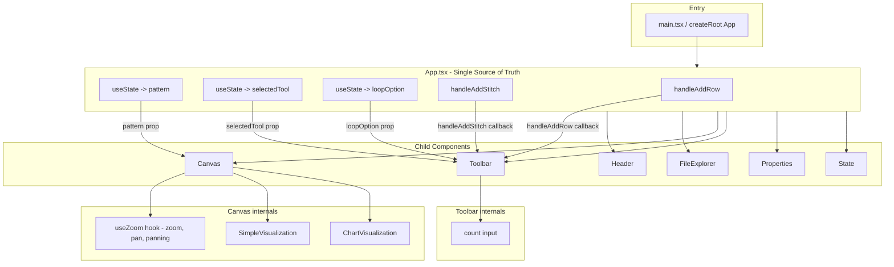
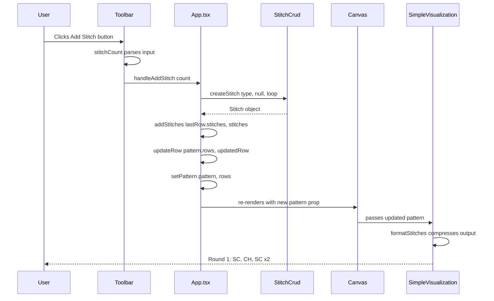
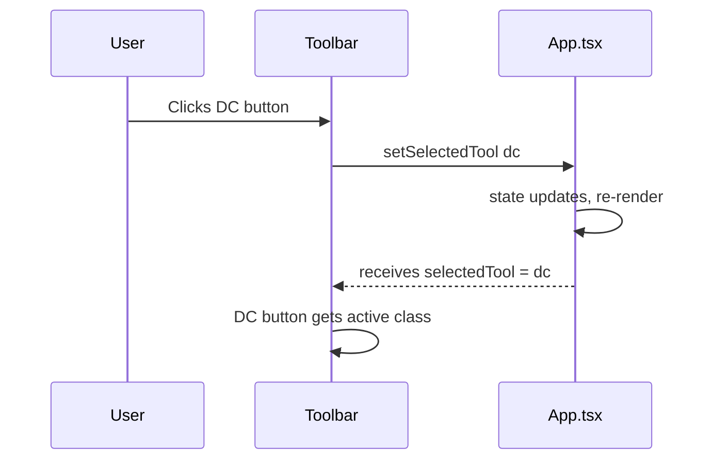
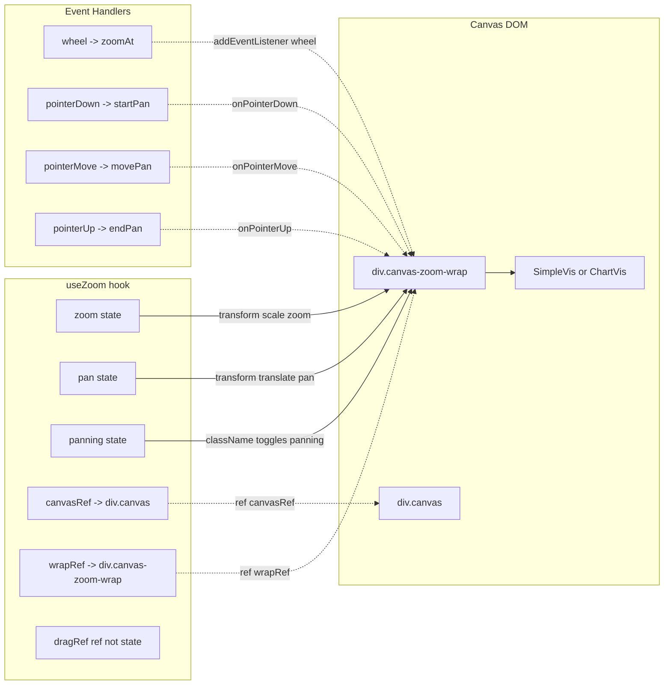
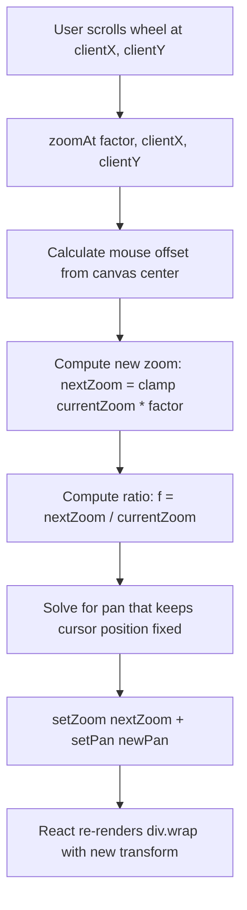
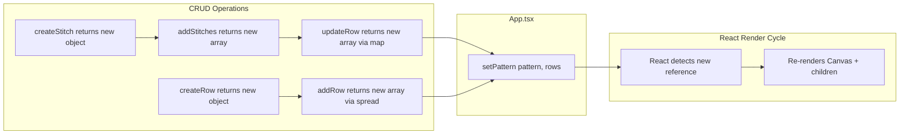
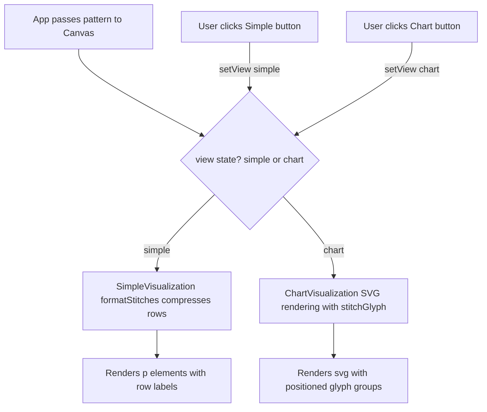
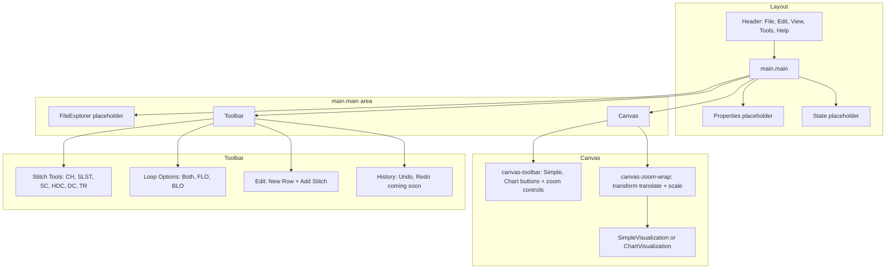

# Project Diagram

## Component Tree & Data Flow

---

## Data Flow: Adding a Stitch

---

## Data Flow: Selecting a Stitch Tool

---

## useZoom: State & DOM Wiring

---

## Zoom Toward Cursor: The Math

---

## Immutable Update Pattern

---

## View Switcher: Simple vs Chart

---

## Full Component Architecture

